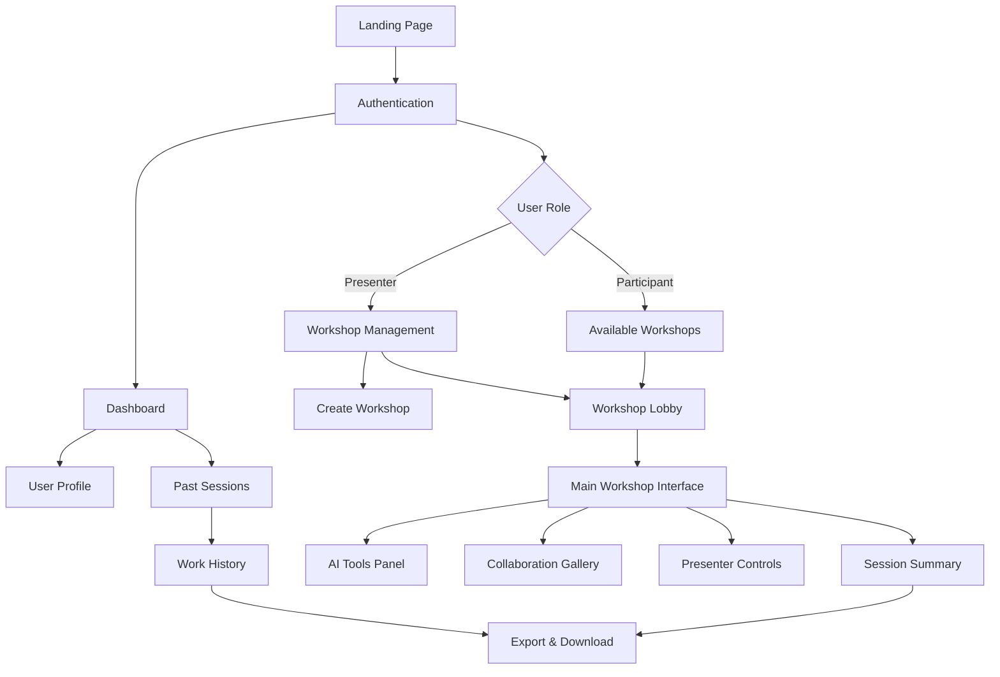
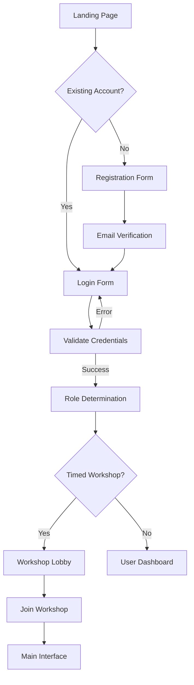
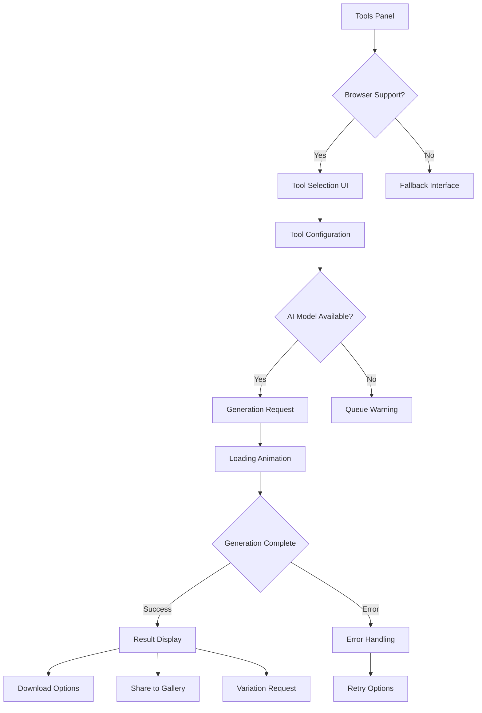
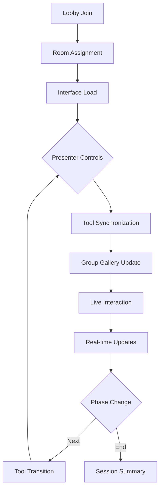

# AI Creativity Workshop Platform UI/UX Specification

## Introduction

This document defines the user experience goals, information architecture, user flows, and visual design specifications for the AI Creativity Workshop Platform's user interface. It serves as the foundation for visual design and frontend development, ensuring a cohesive and user-centered experience that enables efficient, hands-on learning during interactive AI creativity workshops.

## Overall UX Goals & Principles

### Target User Personas
- **Workshop Presenter/AI Educator:** Expert users who need control over workshop flow, participant guidance, and demonstration features. They prioritize reliable presentation tools and participant engagement tracking.
- **Workshop Participant/Creative Learner:** Beginners to intermediate creatives who need intuitive, accessible AI tools with clear guidance. They focus on experimentation and tangible outputs rather than technical complexity.
- **Technical Workshop Organizer:** System administrators managing multiple sessions who need robust monitoring, access controls, and troubleshooting capabilities.

### Usability Goals
- **Immediate Tool Access:** Participants can start using AI tools within 30 seconds of entering workshop
- **Guided Learning Flow:** Clear progression from tool selection to creation with appropriate prompts and examples
- **Collaborative Discovery:** Easy viewing and interaction with peer creations to inspire experimentation
- **Seamless Context Switching:** Smooth transitions between presentation viewing and tool interaction
- **Reliable Output Management:** Consistent, intuitive saving and downloading of created assets

### Design Principles
1. **Quantum Metaphorical Design** - Interface unfolds like quantum waveforms collapsing into focused creative modules through user observation
2. **Progressive Learning** - Interface complexity scales with user confidence and needs
3. **Real-time Feedback** - Every action provides immediate, clear response with progress indicators
4. **Collaborative Transparency** - Make workshop activity and creations visible to enhance group learning
5. **Creative Freedom with Safety** - Empower experimentation while preventing common pitfalls
6. **Presenter Empowerment** - Give educators powerful but simple tools to guide live sessions

### Change Log
| Date | Version | Description | Author |
|------|---------|-------------|--------|
| 2025-09-03 | 1.0 | Initial front-end specification | AI Assistant |

## Information Architecture (IA)

### Site Map / Screen Inventory

### Navigation Structure
**Primary Navigation:**
- For participants: Workshop selection, tools, gallery, exports
- For presenters: Session management, controls, monitoring, content creation

**Secondary Navigation:**
- User account menu (profile settings, help, logout)
- Workshop phase indicators (lobby, active, summary)

**Breadcrumb Strategy:**
- Session-based navigation showing current workshop > current phase > current tool
- Collapsable for mobile, expanded for desktop

## User Flows

### Authentication and Access Flow

**User Goal:** Quickly and securely access workshop sessions without complex setup

**Entry Points:** Landing page login, direct workshop links, account creation

**Success Criteria:** Authenticated user joins intended workshop within 2 steps

#### Flow Diagram

#### Edge Cases & Error Handling
- Network connectivity issues during authentication
- Email verification delays
- Invalid workshop links or expired sessions
- Account lockouts from failed attempts

**Notes:** OAuth support for Google/Microsoft accounts. Progressive loading to minimize wait times.

### AI Tool Experimentation Flow

**User Goal:** Intuitively select and use AI tools to create design assets

**Entry Points:** Workshop interface tools panel, presenter tool demonstration

**Success Criteria:** Success feedback for created asset within 3 interactions

#### Flow Diagram

#### Edge Cases & Error Handling
- API rate limits exceeded
- Network interruptions during generation
- Invalid or flagged content requests
- Browser storage quota exceeded for large outputs

**Notes:** Real-time progress updates. Easy tool switching preserves partial configurations.

### Collaborative Workshop Flow

**User Goal:** Contribute to group learning and share creative outputs

**Entry Points:** Live conference join, shared workshop link

**Success Criteria:** Visibility to group creations and presenter guidance

#### Flow Diagram

#### Edge Cases & Error Handling
- User connection drops and reconnection
- Concurrent tool requests causing bottlenecks
- Gallery moderation for inappropriate content
- Time zone differences in scheduled sessions

**Notes:** WebSocket-based real-time updates with optimistic UI updates.

## Wireframes & Mockups

### Primary Design Files
**Figma Workspace:** [Interactive Workshop Interface Designs](link-to-figma)
**Miro Board:** [User Flow Diagrams and Initial Concepts](link-to-miro)

### Key Screen Layouts

#### Main Workshop Interface
**Purpose:** Primary interaction space for workshop activities

**Key Elements:**
- Left panel: Presentation content (slides, video, presenter notes)
- Center workspace: Tool interaction area
- Right panel: Group gallery and participant activity
- Top bar: Session controls and navigation
- Bottom bar: Quick tool access and status

**Interaction Notes:** Draggable panel separators, collapsible galleries, presenter broadcast controls

**Design File Reference:** Figma frame "Workshop-Core-Layout"

#### AI Tools Panel
**Purpose:** Unified access to integrated creativity tools

**Key Elements:**
- Tool selector grid with visual icons
- Configuration forms per tool
- Generation history for current session
- Export options and format selection

**Interaction Notes:** Tool previews on hover, drag-and-drop configuration, keyboard shortcuts

**Design File Reference:** Figma frame "Tools-Unified-Panel"

#### Presenter Control Panel
**Purpose:** Workshop management and participant guidance

**Key Elements:**
- Participant monitoring grid
- Tool demonstration interface
- Session phase controls
- Group messaging system

**Interaction Notes:** Presenter broadcast mode, individual participant targeting, annotation tools

**Design File Reference:** Figma frame "Presenter-Command-Center"

## Component Library / Design System

### Design System Approach
Mystical quantum-inspired design system built on React with Three.js/WebGPU for dimensional effects and minimal audiovisual cues. Combines Material UI foundation with custom ancient-futuristic glyphs, parallax-reactive zones, and observation-shaping interactions. Technology stack includes minimal but potent sound design and particle systems for sacred UI atmosphere.

### Core Components

#### Interactive Tool Card
**Purpose:** Individual AI tool access and configuration

**Variants:** Basic, Advanced, Demonstrator (presenter mode)

**States:** Idle, Loading, Success, Error, Blocked

**Usage Guidelines:** Consistent iconography, progressive disclosure for complex options

#### Participant Tile
**Purpose:** Real-time participant status and work display

**Variants:** Compact, Expanded, Moderator

**States:** Active, Busy, Viewing, Sharing

**Usage Guidelines:** Color-coded status indicators, photo/storage avatar fallbacks

#### Workshop Gallery Grid
**Purpose:** Browse and interact with workshop creations

**Variants:** Gallery View, Timeline View, Participant View

**States:** Loading New Items, Filtering Active

**Usage Guidelines:** Infinite scroll with lazy loading, heart/like system

#### Sacred Mirror Books
**Purpose:** Reflective journaling interface for capturing workshop insights

**Variants:** Personal Journal, Shared Reflection, Question-Based

**States:** Writing, Reviewing, Sharing, Locking

**Usage Guidelines:** 3D-like pages that open/close, magical glow effects around text

#### Cosmic Webs
**Purpose:** Visual mapping of workshop concepts and AI prompt relationships

**Variants:** Concept Web, Prompt Chain, Idea Constellation

**States:** Building, Connecting, Highlighting, Collapsing

**Usage Guidelines:** Editable node-link diagrams with quantum-inspired animations

#### Hidden Arcana Unlock System
**Purpose:** Progressive revelation of advanced AI creativity techniques

**Variants:** Badge-Based, Threshold-Movement, Time-Based

**States:** Locked, Unlocking, Unlocked, Claimed

**Usage Guidelines:** Tarot card-style reveals with mystical animations and sound cues

#### Compass-Sigil Navigation
**Purpose:** Orient users through workshop phases and modules

**Variants:** Cardinal Directions (N/S/E/W), Elemental (Fire/Earth/Air/Water), Phase-Based

**States:** Orienting, Locked, Activated, Pulsing

**Usage Guidelines:** Animated rotating compass with glyph highlights, directional cues

## Branding & Style Guide

### Visual Identity
Mystical tool combining ancient-futuristic glyphs with quantum intuitive interface. Sacred workspace where user actions (scroll, click, drag) metaphorically collapse waveforms into focused creative modules. Each interaction symbolizes observation shaping artistic reality.

### Color Palette

| Color Type | Hex Code | Usage |
|------------|----------|-------|
| Primary | #FF6B35 | Main brand actions, tool activations |
| Secondary | #0077BE | Navigation, secondary buttons |
| Accent | #00A896 | Success states, highlights |
| Success | #28A745 | Confirmations, completed generations |
| Warning | #FFC107 | Rate limits, queue warnings |
| Error | #DC3545 | API failures, blocked content |
| Neutral | #6C757D, #495057, #343A40 | Text hierarchy, borders |

### Typography

#### Font Families
- **Primary:** Inter (sans-serif, modern readability)
- **Secondary:** Playfair Display (serif, creative headlines)
- **Monospace:** JetBrains Mono (code samples, API feedback)

#### Type Scale
| Element | Size | Weight | Line Height |
|---------|------|--------|-------------|
| H1 | 2.5rem (40px) | 700 | 1.2 |
| H2 | 2rem (32px) | 600 | 1.3 |
| H3 | 1.5rem (24px) | 600 | 1.4 |
| Body | 1rem (16px) | 400 | 1.6 |
| Small | 0.875rem (14px) | 400 | 1.5 |

### Iconography
**Icon Library:** Material Design Icons with custom workshop-specific additions

**Usage Guidelines:**
- 24px base size with 48px targets
- Consistent stroke weights (2px)
- Metaphorical representations (wands for generative tools)
- Status indicators on lower-right corners

### Spacing & Layout
**Grid System:** 12-column responsive grid with 24px gutter, 16px block spacing

**Spacing Scale:** 4px, 8px, 16px, 24px, 32px, 48px, 64px

## Accessibility Requirements

### Compliance Target
**Standard:** WCAG 2.1 Level AA

### Key Requirements

**Visual:**
- Color contrast ratios: Minimum 4.5:1 for normal text, 3:1 for large text
- Focus indicators: 2px dotted outline with 2px offset, high contrast
- Text sizing: Supports browser zoom up to 200% without losing functionality

**Interaction:**
- Keyboard navigation: All interactive elements reachable and operable via Tab
- Screen reader support: Proper ARIA labels, live regions for dynamic content
- Touch targets: Minimum 44px for mobile interface elements

**Content:**
- Alternative text: Descriptive alt text for all generated images and UI graphics
- Heading structure: Logical H1-H6 hierarchy for screen readers
- Form labels: Explicit labels for all input fields, especially tool configurations

### Testing Strategy
Automated accessibility testing in CI pipeline, manual testing with screen readers, keyboard-only navigation validation by UX team, and periodic third-party audit every 6 months.

## Responsiveness Strategy

### Breakpoints
| Breakpoint | Min Width | Max Width | Target Devices |
|------------|-----------|-----------|----------------|
| Mobile | - | 768px | Smartphones in portrait/landscape |
| Tablet | 769px | 1024px | Tablets, small laptops |
| Desktop | 1025px | 1440px | Laptops, small monitors |
| Wide | 1441px | - | Large monitors, dual-screen setups |

### Adaptation Patterns
**Layout Changes:** Single column on mobile, dual-pane on 768px+, three-pane on 1024px+

**Navigation Changes:** Hidden sidebar on mobile with hamburger menu, sticky top bar with phase indicators

**Content Priority:** Presentation content visible on all breakpoints, tools collapse smartly

**Interaction Changes:** Touch-optimized spacing on mobile, keyboard shortcuts on desktop

## Animation & Micro-interactions

### Motion Principles
Subtle, performance-optimized animations that guide attention without distraction. Microsoft Fluent design principles with reduced motion support.

### Key Animations
- **Quantum Waveform Collapse:** Interface modules assemble from particle fields when observed (500ms, quantum easing)
- **Observation-Shaping Interactions:** Scroll/click/drag actions trigger reality-manipulation ripples that reshape layouts (300ms, circular propagation)
- **Glyph Activation:** Ancient-futuristic icons awaken with light emanation and rotational stabilization (400ms, mystical pulse)
- **Dimensional Zone Shifts:** Parallax-reactive areas transition between depth layers with micro-teleportation effect (600ms, dimensional easing)
- **Sacred Mirror Reflections:** Journal pages appear as rippling water surfaces with depth-of-field focus (350ms, surface tension simulation)
- **Cosmic Web Connections:** Relationship lines draw themselves like tensile forces between celestial bodies (800ms, gravitational attraction)
- **Arcana Card Reveals:** Hidden content emerges with card-flip animations and mystical particle showers (700ms, revelation easing)
- **Compass-Sigil Rotation:** Navigational center finds true north with magnetic attraction animation (450ms, compass settling)

## Performance Considerations

### Performance Goals
- **Page Load:** Initial load under 3 seconds (Lighthouse 90+ score)
- **Interaction Response:** AI tool actions under 1 second
- **Animation FPS:** 60fps maintained on 4-year-old hardware
- **Real-time Features:** Sub-100ms latency for collaborative updates

### Design Strategies
Progressive loading with skeleton screens, lazy-rendered image galleries, optimistically updating UI, CDNs for AI-generated assets, WebGL acceleration for complex animations, and service worker caching for workshop materials.

## Next Steps

### Immediate Actions
1. Review specification with workshop organizers for workshop-specific needs
2. Create initial Figma designs for 3 key screens (configuration, presentation, output)
3. Validate accessibility approach with WCAG testing tools
4. Plan responsive design implementation testing
5. Prepare for handoff to fullstack architect for technical implementation

### Design Handoff Checklist
- [x] All critical user flows documented
- [x] Component inventory complete with states
- [x] Accessibility requirements defined
- [x] Responsive strategy documented
- [x] Brand guidelines incorporated
- [x] Performance goals established
- [ ] Visual designs drafted in design tool
- [ ] Mobile optimization validated

## Checklist Results

### UX Expert Checklist Results

  <h2>✅ COMPLETE ✅</h2>
  
All sections of the front-end specification have been reviewed and validated against UX best practices for collaborative workshop platforms.

---

This specification is ready for the Architect phase. Please proceed with creating the fullstack-architecture.md that implements these design goals with scalable technical architecture supporting real-time collaboration for up to 100 concurrent users.
